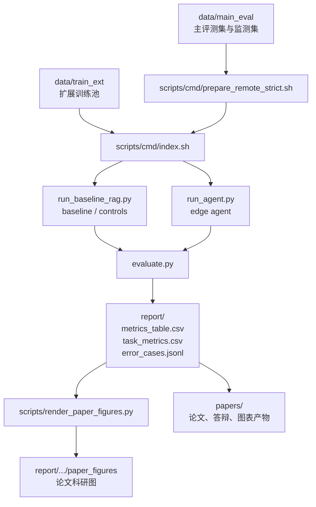

# TaroAIS End-side Small Model Experiment (Qwen3 4B)

本仓库用于复现和扩展一条面向端侧小模型的长文档问答实验主线。当前默认研究设定为：

- 主模型：`qwen3:4b`
- 主评测集：`LongBench_3tasks canonical`
- 主任务组：`single_doc_qa / multi_doc_qa / code_qa`
- 主流程：`prepare -> index -> baseline -> compare_controls -> agent -> eval -> ablations -> bench_key_tasks`

仓库里同时保留了论文包、答辩材料、历史实验痕迹和兼容性小数据，因此第一次进入时容易感觉目录较多。实际使用时，建议只优先关注本文档列出的“正式主线目录”和“正式命令入口”。

## 1. 仓库架构图



## 2. 正式主线目录

- `configs/`
  - 模型、基线、agent、student 等配置文件。
- `data/main_eval/`
  - 正式主评测集、开发监测集、保留验证集、快速筛查集。
- `data/train_ext/`
  - 扩展训练池与专项训练子集。
- `scripts/`
  - 数据准备、自动迭代、图表渲染、聚合与辅助脚本。
- `scripts/cmd/`
  - 推荐直接执行的命令入口。
- `results/`
  - 模型推理输出 JSONL。
- `report/`
  - 评测输出、表格、错误样例、聚合结果、论文图。
- `papers/`
  - 论文包、答辩包、图表源码、审校材料。

## 3. 历史或下游目录说明

- `docs/`
  - 研究设计、实验说明、论文草稿与附录。
- `docs_dataset_upgrade/`
  - 数据体系升级时的过渡文档。
- `report_tiny/`、`report_student/`、`report_live/`
  - smoke、student 或运行监控相关输出。
- `data/minilongbench_*`
  - 兼容保留的小样本旧路径，不是正式主实验默认入口。
- `papers/final_delivery_*`
  - 论文终稿与提交产物目录，属于实验结果的下游写作层。

## 4. 当前默认数据体系

### 4.1 主评测数据

- `data/main_eval/longbench_3tasks_test.jsonl`
  - 正式主评测集，默认规模 `2550`。
- `data/main_eval/longbench_3tasks_dev100.jsonl`
  - 高频调参与监测集。
- `data/main_eval/longbench_3tasks_holdout100.jsonl`
  - 风险复核集。
- `data/main_eval/longbench_3tasks_quickgate30.jsonl`
  - 快速门禁集。

主评测集的三类任务组及样本数：

- `single_doc_qa`：`750`
- `multi_doc_qa`：`800`
- `code_qa`：`1000`

### 4.2 训练扩展数据

统一训练池与验证池：

- `data/train_ext/combined_train.jsonl`
- `data/train_ext/combined_valid.jsonl`

专项来源：

- 单文档：NarrativeQA、Qasper
- 多文档：HotpotQA、MuSiQue
- 代码问答：RepoBench Python、RepoBench Java

### 4.3 数据来源

主评测与扩展训练池的数据来源记录在：

- [data/manifests/dataset_registry.json](D:/taroPROJECT/end%20design/TaroAIS-End-side-small-model-experiment-qwen/data/manifests/dataset_registry.json)
- [data/manifests/dataset_versions.json](D:/taroPROJECT/end%20design/TaroAIS-End-side-small-model-experiment-qwen/data/manifests/dataset_versions.json)

当前主评测与训练扩展数据集来源如下：

- `zai-org/LongBench`
  - 主评测 `LongBench_3tasks canonical`
- `deepmind/narrativeqa`
- `allenai/qasper`
- `hotpotqa/hotpot_qa`
- `dgslibisey/MuSiQue`
- `tianyang/repobench_python_v1.1`
- `tianyang/repobench_java_v1.1`

说明：

- 仓库提交的是数据准备脚本、版本信息与小规模 smoke 数据。
- 大体量 JSONL 数据默认在本地生成，不建议直接提交到 Git。

## 5. 从零跑起的完整流程

以下命令默认在仓库根目录执行。Windows 下建议使用 Git Bash，或者在 PowerShell 中以 `bash scripts/cmd/xxx.sh` 的方式运行。

### 5.1 环境准备

```bash
python -m venv .venv
.venv\Scripts\activate
pip install -r requirements.txt
```

如果使用本地 Ollama，请确保目标模型已可用，例如：

```bash
ollama list
```

### 5.2 最小 smoke 链路

```bash
bash scripts/cmd/smoke.sh
```

用途：

- 检查 Python 依赖、基础脚本链路和最小输入输出是否正常。

### 5.3 数据准备

```bash
bash scripts/cmd/prepare_remote_strict.sh
```

该命令会顺序执行：

1. `scripts/prepare_longbench_3tasks.py`
2. `scripts/prepare_task_ext_corpus.py`
3. `scripts/build_combined_ext_sets.py`
4. `scripts/build_main_eval_sets_v2.py`

### 5.4 建索引

```bash
bash scripts/cmd/index.sh
```

默认输入：

- `data/train_ext/combined_train.jsonl`

默认输出：

- `data/corpus_chunks.jsonl`
- `data/index/index_meta.json`
- `data/index/chunks.jsonl`

### 5.5 正式实验拆步执行

1. Anchor baseline

```bash
bash scripts/cmd/baseline.sh
```

2. 强对照基线

```bash
bash scripts/cmd/compare_controls.sh
```

3. Agent

```bash
bash scripts/cmd/agent.sh
```

4. 评测与自动生成论文图

```bash
bash scripts/cmd/eval.sh
```

5. 消融

```bash
bash scripts/cmd/ablations.sh
```

6. 关键任务与多种子确认

```bash
bash scripts/cmd/bench_key_tasks.sh
```

### 5.6 一键跑正式主流程

```bash
bash scripts/cmd/main_formal.sh
```

该入口默认执行：

1. `preflight_formal.sh`
2. `prepare_remote_strict.sh`
3. `index.sh`
4. `baseline.sh`
5. `compare_controls.sh`
6. `agent.sh`
7. `eval.sh`
8. `ablations.sh`
9. `bench_key_tasks.sh`

## 6. 可选流程

### 6.1 自动迭代

```bash
python scripts/auto_iterate_formal.py
```

默认使用：

- canonical：`data/main_eval/longbench_3tasks_test.jsonl`
- dev：`data/main_eval/longbench_3tasks_dev100.jsonl`
- holdout：`data/main_eval/longbench_3tasks_holdout100.jsonl`
- train：`data/train_ext/combined_train.jsonl`
- valid：`data/train_ext/combined_valid.jsonl`

### 6.2 Student 分支

```bash
bash scripts/cmd/student_branch.sh
```

用于：

- teacher 数据蒸馏
- student 训练
- student 评测

该分支是附加实验，不属于正式主实验的必经步骤。

### 6.3 论文图单独生成

如果已经有 `report/<run_name>/metrics_table.csv` 等结果文件，可以直接生成论文科研图，而不需要重跑实验：

```bash
bash scripts/cmd/render_paper_figures.sh
```

默认输出：

- `report/formal_paper_canonical_s42_current/paper_figures`

## 7. 运行完成后会得到什么

实验跑完后，通常会在 `results/` 和 `report/` 下看到以下产物。

### 7.1 推理结果

- `results/baseline_rag.jsonl`
- `results/baseline_budget_matched.jsonl`
- `results/baseline_single_round_strong.jsonl`
- `results/edge_agent.jsonl`

### 7.2 评测结果

- `report/metrics_table.csv`
- `report/task_metrics.csv`
- `report/key_task_summary.csv`
- `report/error_cases.jsonl`

### 7.3 论文科研图

- `report/paper_figures/*.png`
- `report/paper_figures/*.svg`

## 8. 实验预期会观察什么

本仓库的实验设计重点不是只看一个总体分数，而是同时观察以下几类现象：

- 三类任务组对同一流程是否表现出不同响应。
- agent 协议是否优于 anchor baseline 与两个强对照基线。
- 质量提升是否伴随额外步数、检索次数、提示长度与时延开销。
- 单文档、多文档、代码问答三类任务之间是否存在明显的收益分化。
- 错误样例主要集中在哪些数据子集和任务组。

也就是说，实验预期输出不仅包括性能数字，还包括：

- 任务分解视角
- 成本与时延视角
- 错误样例视角
- 论文图和答辩图所需的下游素材

## 9. 推荐阅读顺序

1. 本 README
2. [docs/00_repo_map.md](D:/taroPROJECT/end%20design/TaroAIS-End-side-small-model-experiment-qwen/docs/00_repo_map.md)
3. [scripts/cmd/README.md](D:/taroPROJECT/end%20design/TaroAIS-End-side-small-model-experiment-qwen/scripts/cmd/README.md)
4. [docs/12_io_contracts.md](D:/taroPROJECT/end%20design/TaroAIS-End-side-small-model-experiment-qwen/docs/12_io_contracts.md)
5. [docs/23_experiment_playbook.md](D:/taroPROJECT/end%20design/TaroAIS-End-side-small-model-experiment-qwen/docs/23_experiment_playbook.md)
6. [docs/14_metrics_definition.md](D:/taroPROJECT/end%20design/TaroAIS-End-side-small-model-experiment-qwen/docs/14_metrics_definition.md)

## 10. 当前建议的使用原则

- 正式主实验优先看 `scripts/cmd/main_formal.sh`。
- 日常单步调试优先看 `baseline.sh / compare_controls.sh / agent.sh / eval.sh`。
- 论文写作与答辩图表优先从 `report/.../paper_figures` 和 `papers/` 读取。
- 看到旧的 `minilongbench_*`、`report_tiny*`、部分历史 paper pack 时，不要把它们当成当前正式主线。
